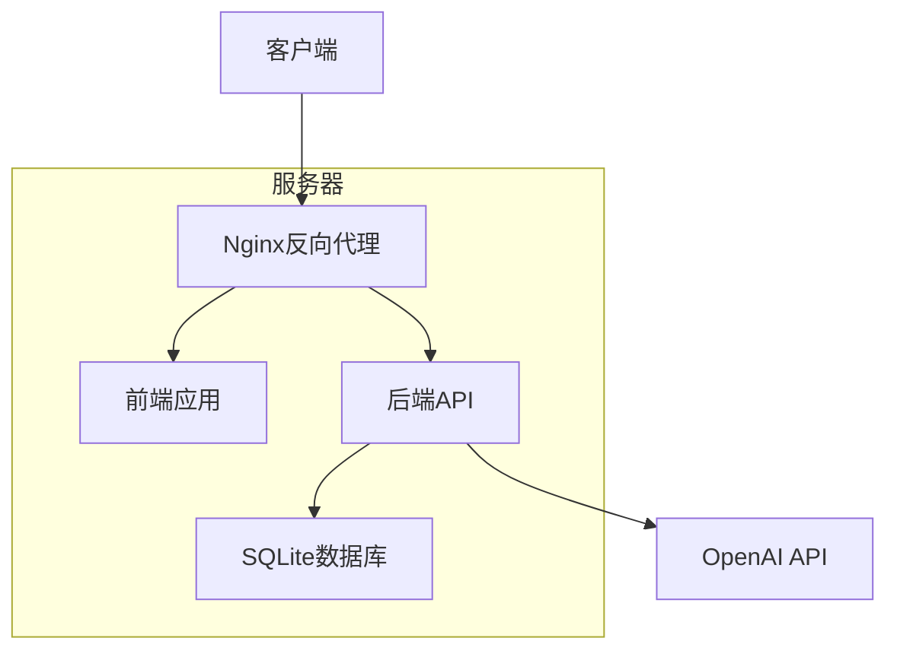

# BeeCount 部署和运维文档

## 1. 部署架构


## 2. 环境配置
### 2.1 服务器要求
- **操作系统**：Ubuntu 20.04 LTS 或 CentOS 8+
- **CPU**：2核及以上
- **内存**：4GB及以上
- **存储**：50GB及以上
- **网络**：公网IP，带宽1Mbps以上

### 2.2 软件依赖
- **前端**：Node.js 18+, npm 9+
- **后端**：Go 1.25+, SQLite 3.30+
- **Web服务器**：Nginx 1.18+
- **SSL**：Let's Encrypt

## 3. 部署流程
### 3.1 前端部署
```bash
# 克隆代码
git clone https://github.com/yourusername/beecount-frontend.git
cd beecount-frontend

# 安装依赖
npm install --legacy-peer-deps

# 构建生产版本
npm run build

# 部署到Nginx
cp -r dist/* /var/www/beecount-frontend/
```

### 3.2 后端部署
```bash
# 克隆代码
git clone https://github.com/yourusername/beecount-backend.git
cd beecount-backend

# 构建
GOOS=linux GOARCH=amd64 go build -o beecount-server

# 复制到部署目录
cp beecount-server /usr/local/bin/
cp beecount.db /var/lib/beecount/

# 创建systemd服务
cat > /etc/systemd/system/beecount.service << EOF
[Unit]
Description=BeeCount Backend Server
After=network.target

[Service]
Type=simple
ExecStart=/usr/local/bin/beecount-server
WorkingDirectory=/var/lib/beecount
Restart=always
RestartSec=5

[Install]
WantedBy=multi-user.target
EOF

# 启动服务
systemctl daemon-reload
systemctl enable beecount
systemctl start beecount
```

### 3.3 Nginx配置
```nginx
server {
    listen 80;
    server_name beecount.example.com;
    return 301 https://$host$request_uri;
}

server {
    listen 443 ssl http2;
    server_name beecount.example.com;
    
    ssl_certificate /etc/letsencrypt/live/beecount.example.com/fullchain.pem;
    ssl_certificate_key /etc/letsencrypt/live/beecount.example.com/privkey.pem;
    
    # 前端静态文件
    location / {
        root /var/www/beecount-frontend;
        index index.html;
        try_files $uri $uri/ /index.html;
    }
    
    # 后端API
    location /api {
        proxy_pass http://localhost:8080;
        proxy_http_version 1.1;
        proxy_set_header Upgrade $http_upgrade;
        proxy_set_header Connection 'upgrade';
        proxy_set_header Host $host;
        proxy_cache_bypass $http_upgrade;
    }
    
    # 文件上传
    location /uploads {
        alias /var/lib/beecount/uploads;
        autoindex off;
    }
}
```

## 4. 环境变量配置
### 4.1 后端配置
创建 `.env` 文件：
```env
# 服务器配置
PORT=8080
HOST=0.0.0.0

# 数据库配置
DATABASE_URL=./beecount.db

# JWT配置
JWT_SECRET=your_jwt_secret_key
JWT_EXPIRES_IN=24h

# OpenAI配置
OPENAI_API_KEY=your_openai_api_key
OPENAI_BASE_URL=https://api.openai.com/v1

# 上传配置
UPLOAD_DIR=./uploads
MAX_UPLOAD_SIZE=10485760

# 日志配置
LOG_LEVEL=info
```

### 4.2 前端配置
创建 `.env` 文件：
```env
# API配置
VITE_API_BASE_URL=https://beecount.example.com/api

# 应用配置
VITE_APP_NAME=BeeCount
VITE_APP_VERSION=1.0.0

# 功能开关
VITE_ENABLE_AI=true
VITE_ENABLE_ANALYTICS=true
```

## 5. 数据库管理
### 5.1 备份策略
```bash
# 每日备份
0 0 * * * cp /var/lib/beecount/beecount.db /var/lib/beecount/backups/beecount_$(date +\%Y\%m\%d).db

# 每周清理旧备份
0 1 * * 0 find /var/lib/beecount/backups -name "beecount_*.db" -mtime +30 -delete
```

### 5.2 恢复流程
```bash
# 停止服务
systemctl stop beecount

# 恢复备份
cp /var/lib/beecount/backups/beecount_20260421.db /var/lib/beecount/beecount.db

# 启动服务
systemctl start beecount
```

## 6. 监控设置
### 6.1 系统监控
- **CPU/内存**：使用 Prometheus + Grafana
- **磁盘空间**：设置阈值告警
- **网络流量**：监控API请求量

### 6.2 应用监控
- **API响应时间**：使用 ELK 栈
- **错误率**：设置错误日志告警
- **业务指标**：用户活跃度、交易量

### 6.3 日志管理
```bash
# 后端日志
journalctl -u beecount.service -f

# Nginx日志
/var/log/nginx/access.log
/var/log/nginx/error.log
```

## 7. 故障排查
### 7.1 常见问题
| 问题 | 可能原因 | 解决方案 |
|------|----------|----------|
| API无响应 | 后端服务未运行 | 启动服务：systemctl start beecount |
| 数据库连接失败 | SQLite文件权限问题 | 检查文件权限：chmod 664 /var/lib/beecount/beecount.db |
| 上传失败 | 目录权限问题 | 创建目录并设置权限：mkdir -p /var/lib/beecount/uploads && chmod 755 /var/lib/beecount/uploads |
| 前端白屏 | 静态文件路径错误 | 检查Nginx配置和文件权限 |

### 7.2 应急响应
1. **服务中断**：启动备用服务器
2. **数据丢失**：从备份恢复
3. **安全漏洞**：临时关闭服务，修复后重新部署

## 8. 版本更新
### 8.1 更新流程
1. **备份数据**：备份数据库和配置文件
2. **更新代码**：拉取最新代码
3. **构建部署**：重新构建和部署
4. **测试验证**：验证核心功能
5. **监控观察**：观察系统运行状态

### 8.2 回滚方案
```bash
# 停止服务
systemctl stop beecount

# 恢复旧版本
cp /usr/local/bin/beecount-server.bak /usr/local/bin/beecount-server
cp /var/lib/beecount/beecount.db.bak /var/lib/beecount/beecount.db

# 启动服务
systemctl start beecount
```

## 9. 安全加固
### 9.1 服务器安全
- 防火墙配置：只开放必要端口
- SSH密钥登录：禁用密码登录
- 定期更新：自动更新系统包
- 入侵检测：安装 Fail2ban

### 9.2 应用安全
- API认证：使用JWT
- 数据加密：传输和存储加密
- 输入验证：防止SQL注入和XSS
- 权限控制：基于角色的访问控制

## 10. 性能优化
### 10.1 前端优化
- 静态资源压缩
- 代码分割和懒加载
- 缓存策略
- CDN加速

### 10.2 后端优化
- 数据库索引
- 查询优化
- 连接池
- 缓存机制

## 11. 扩展性考虑
### 11.1 水平扩展
- 负载均衡：使用Nginx负载均衡
- 数据库复制：主从复制
- 会话共享：使用Redis

### 11.2 垂直扩展
- 升级服务器配置
- 优化代码和数据库
- 使用更高效的算法

## 12. 运维工具
- **部署工具**：Ansible、Docker
- **监控工具**：Prometheus、Grafana
- **日志工具**：ELK Stack
- **备份工具**：rsync、restic
- **安全工具**：Let's Encrypt、Fail2ban