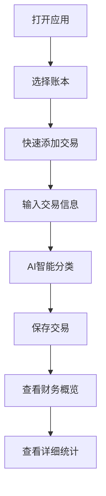

## 1. 产品概述
BeeCount是一款智能记账应用，帮助用户轻松管理个人财务，通过AI智能分类提升记账效率。
- 解决用户记账繁琐、分类困难的问题，为个人用户提供便捷的财务管理工具
- 目标用户为需要管理个人财务的普通用户，市场价值在于简化财务管理流程，提高财务透明度

## 2. 核心功能

### 2.1 用户角色
| 角色 | 注册方式 | 核心权限 |
|------|----------|----------|
| 普通用户 | 邮箱注册 | 管理个人账本、记录交易、查看统计分析 |
| 高级用户 | 升级 | AI智能分类、数据导出、高级统计 |

### 2.2 功能模块
1. **首页**：财务概览、最近交易、快速添加
2. **交易管理**：交易记录、分类管理、搜索筛选
3. **账户管理**：账户创建、余额管理、类型设置
4. **统计分析**：收支趋势、分类分析、预算管理
5. **AI助手**：智能分类、交易分析、预算建议
6. **设置**：个人信息、主题设置、数据备份

### 2.3 页面详情
| 页面名称 | 模块名称 | 功能描述 |
|---------|---------|----------|
| 首页 | 财务概览 | 显示总收入、支出、余额，提供快速财务状况查看 |
| 首页 | 最近交易 | 展示最近10条交易记录，支持快速编辑和删除 |
| 首页 | 快速添加 | 一键添加新交易，简化记账流程 |
| 交易管理 | 交易列表 | 显示所有交易记录，支持按日期、分类、金额筛选 |
| 交易管理 | 交易详情 | 查看和编辑交易的详细信息，包括金额、分类、账户等 |
| 交易管理 | 分类管理 | 创建和管理交易分类，支持自定义图标和颜色 |
| 账户管理 | 账户列表 | 显示所有账户及其余额，支持编辑和删除 |
| 账户管理 | 账户详情 | 设置账户名称、类型、初始余额等信息 |
| 统计分析 | 收支趋势 | 图表展示收支变化趋势，支持按日/周/月/年查看 |
| 统计分析 | 分类分析 | 饼图展示不同分类的支出占比，帮助用户了解消费结构 |
| 统计分析 | 预算管理 | 设置每月预算，实时查看预算使用情况 |
| AI助手 | 智能分类 | 基于交易描述自动分类，学习用户记账习惯 |
| AI助手 | 交易分析 | 分析用户消费模式，提供省钱建议 |
| AI助手 | 预算建议 | 根据历史消费数据，智能推荐预算设置 |
| 设置 | 个人信息 | 管理用户基本信息，修改密码 |
| 设置 | 主题设置 | 切换浅色/深色模式，个性化界面 |
| 设置 | 数据备份 | 导出和导入记账数据，确保数据安全 |

## 3. 核心流程
用户记账核心流程：用户打开应用 → 选择账本 → 点击快速添加 → 输入交易信息 → 系统自动分类 → 保存交易 → 查看财务概览

## 4. 用户界面设计
### 4.1 设计风格
- 主色调：#1976d2（蓝色）、#4caf50（绿色）
- 辅助色：#ff5722（橙色）、#f44336（红色）
- 按钮风格：圆角矩形，带有轻微阴影
- 字体：Roboto，大小从12px到24px
- 布局风格：卡片式布局，清晰的信息层次
- 图标风格：Material Design图标，简洁现代

### 4.2 页面设计概览
| 页面名称 | 模块名称 | UI元素 |
|---------|---------|--------|
| 首页 | 财务概览 | 三个卡片式模块，分别显示收入、支出、余额，使用不同颜色区分，数字较大且醒目 |
| 首页 | 最近交易 | 列表式布局，每条交易包含类型、金额、分类、日期，支持滑动操作 |
| 首页 | 快速添加 | 浮动按钮，点击后弹出表单，表单包含金额输入、分类选择、账户选择等 |
| 交易管理 | 交易列表 | 表格布局（桌面端）/卡片布局（移动端），支持排序和筛选 |
| 统计分析 | 收支趋势 | 折线图，支持时间范围选择，颜色渐变效果 |
| 统计分析 | 分类分析 | 饼图，每个分类使用不同颜色，悬停显示详细数据 |
| AI助手 | 智能分类 | 聊天界面，显示AI分析结果和建议 |

### 4.3 响应性
- 设计理念：移动优先，响应式布局
- 断点设置：360px（手机）、768px（平板）、1200px（桌面）
- 触摸优化：所有可点击元素最小尺寸44x44px，按钮间距适当
- 布局适配：小屏幕垂直堆叠，大屏幕多列布局

### 4.4 交互设计
- 微动画：按钮点击、页面切换、数据加载等场景使用平滑过渡
- 反馈机制：操作成功/失败提示，加载状态指示
- 手势支持：滑动删除、下拉刷新、双指缩放图表
- 无障碍：支持屏幕阅读器，键盘导航