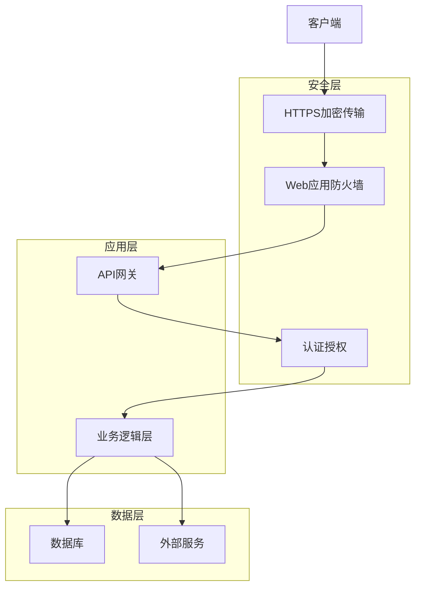

# BeeCount 安全设计文档

## 1. 安全架构
### 1.1 系统安全架构

### 1.2 安全原则
- **最小权限原则**：只授予必要的权限
- **防御纵深**：多层次安全防护
- **安全优先**：安全设计优先于功能实现
- **持续改进**：定期安全评估和改进

## 2. 认证与授权
### 2.1 认证机制
- **JWT认证**：使用JSON Web Token进行身份验证
- **密码哈希**：使用bcrypt对密码进行哈希处理
- **会话管理**：无状态会话，减少会话劫持风险
- **多因素认证**：支持短信验证码、邮箱验证码

### 2.2 授权机制
- **基于角色的访问控制 (RBAC)**：不同角色有不同权限
- **权限验证**：每个API请求都进行权限验证
- **资源所有权**：用户只能访问自己的资源
- **权限缓存**：优化权限验证性能

## 3. 数据安全
### 3.1 数据加密
- **传输加密**：使用TLS 1.3加密传输
- **存储加密**：敏感数据加密存储
- **密码加密**：使用bcrypt进行密码哈希
- **API密钥**：加密存储第三方API密钥

### 3.2 数据保护
- **数据脱敏**：敏感数据脱敏处理
- **数据备份**：定期备份数据
- **数据恢复**：建立数据恢复机制
- **数据销毁**：安全删除不再需要的数据

### 3.3 数据库安全
- **SQL注入防护**：使用参数化查询
- **数据库权限**：最小权限原则
- **数据库审计**：记录数据库操作
- **数据库加密**：敏感字段加密存储

## 4. API安全
### 4.1 API防护
- **API密钥**：使用API密钥进行身份验证
- **请求限流**：防止API滥用
- **参数验证**：验证所有API参数
- **响应格式化**：统一API响应格式

### 4.2 API监控
- **异常检测**：检测异常API调用
- **访问日志**：记录API访问日志
- **性能监控**：监控API响应时间
- **错误监控**：监控API错误率

## 5. 前端安全
### 5.1 前端防护
- **XSS防护**：防止跨站脚本攻击
- **CSRF防护**：防止跨站请求伪造
- **输入验证**：客户端输入验证
- **敏感信息保护**：不在前端存储敏感信息

### 5.2 前端安全实践
- **内容安全策略 (CSP)**：限制脚本执行
- **HTTP严格传输安全 (HSTS)**：强制使用HTTPS
- **X-Content-Type-Options**：防止MIME类型嗅探
- **X-Frame-Options**：防止点击劫持

## 6. 后端安全
### 6.1 后端防护
- **代码审计**：定期代码安全审计
- **依赖检查**：检查第三方依赖漏洞
- **服务器加固**：加固服务器配置
- **网络隔离**：隔离不同环境

### 6.2 后端安全实践
- **最小权限**：运行服务使用最小权限用户
- **环境变量**：使用环境变量存储敏感配置
- **错误处理**：不暴露详细错误信息
- **日志记录**：记录安全相关事件

## 7. 第三方服务安全
### 7.1 OpenAI API安全
- **API密钥管理**：安全存储API密钥
- **请求验证**：验证OpenAI API响应
- **使用限制**：设置API使用限制
- **数据保护**：不发送敏感数据

### 7.2 其他第三方服务
- **服务评估**：评估第三方服务安全性
- **数据传输**：加密传输数据
- **访问控制**：限制第三方服务访问
- **监控**：监控第三方服务状态

## 8. 安全测试
### 8.1 安全测试策略
- **渗透测试**：定期进行渗透测试
- **漏洞扫描**：使用工具扫描漏洞
- **代码审计**：手动和自动代码审计
- **安全评估**：定期安全评估

### 8.2 安全测试工具
- **静态代码分析**：SonarQube、ESLint
- **动态测试**：OWASP ZAP、Burp Suite
- **依赖检查**：npm audit、go get -u
- **安全扫描**：Nmap、Nikto

## 9. 安全事件响应
### 9.1 事件响应计划
- **事件分类**：根据严重程度分类安全事件
- **响应流程**：定义安全事件响应流程
- **应急团队**：组建安全应急响应团队
- **沟通计划**：制定事件沟通计划

### 9.2 事件处理
- **事件检测**：及时检测安全事件
- **事件分析**：分析事件原因和影响
- **事件缓解**：采取措施缓解事件影响
- **事件恢复**：恢复系统正常运行

### 9.3 事件记录
- **事件日志**：详细记录安全事件
- **事件分析**：分析事件模式和趋势
- **事件报告**：生成安全事件报告
- **改进措施**：基于事件改进安全措施

## 10. 安全合规
### 10.1 合规要求
- **数据保护法规**：遵守GDPR、CCPA等
- **金融法规**：遵守相关金融法规
- **行业标准**：遵循ISO 27001、PCI DSS
- **内部政策**：符合公司安全政策

### 10.2 合规认证
- **安全认证**：获取相关安全认证
- **合规审计**：定期合规审计
- **文档记录**：保持合规文档记录
- **培训**：定期安全合规培训

## 11. 安全最佳实践
### 11.1 开发安全
- **安全编码**：遵循安全编码规范
- **代码审查**：包含安全审查
- **测试覆盖**：包含安全测试
- **持续集成**：集成安全扫描

### 11.2 运维安全
- **配置管理**：版本控制配置文件
- **变更管理**：管理安全相关变更
- **访问控制**：严格控制服务器访问
- **定期更新**：及时更新系统和依赖

### 11.3 人员安全
- **安全培训**：定期安全意识培训
- **权限管理**：基于最小权限原则
- **背景调查**：对关键岗位进行背景调查
- **离职流程**：确保离职人员权限及时撤销

## 12. 安全风险评估
### 12.1 风险识别
- **资产识别**：识别关键资产
- **威胁评估**：评估潜在威胁
- **漏洞评估**：评估系统漏洞
- **影响分析**：分析安全事件影响

### 12.2 风险分析
- **风险评分**：对风险进行评分
- **风险排序**：按优先级排序风险
- **风险缓解**：制定风险缓解措施
- **风险监控**：持续监控风险状态

### 12.3 风险缓解
- **技术措施**：实施技术安全措施
- **管理措施**：制定安全管理措施
- **人员措施**：加强人员安全意识
- **应急措施**：建立应急响应机制

## 13. 安全监控
### 13.1 监控策略
- **实时监控**：实时监控安全事件
- **预警机制**：建立安全预警机制
- **异常检测**：检测异常行为
- **趋势分析**：分析安全趋势

### 13.2 监控工具
- **SIEM系统**：安全信息和事件管理
- **日志管理**：集中管理日志
- **入侵检测**：检测入侵行为
- **漏洞管理**：管理系统漏洞

### 13.3 监控指标
- **安全事件数量**：监控安全事件数量
- **响应时间**：监控事件响应时间
- **漏洞修复率**：监控漏洞修复率
- **安全评分**：定期评估安全状态

## 14. 安全文档
### 14.1 安全策略
- **安全方针**：公司安全方针
- **安全标准**：安全技术标准
- **安全流程**：安全管理流程
- **安全责任**：安全责任分配

### 14.2 安全指南
- **开发安全指南**：安全编码指南
- **运维安全指南**：系统运维安全指南
- **应急响应指南**：安全事件应急响应指南
- **第三方安全指南**：第三方服务安全指南

### 14.3 安全审计
- **审计计划**：安全审计计划
- **审计报告**：安全审计报告
- **整改计划**：安全问题整改计划
- **审计跟踪**：审计结果跟踪

## 15. 结论
### 15.1 安全目标
- **数据保护**：确保用户数据安全
- **系统安全**：确保系统稳定运行
- **合规要求**：满足相关法规要求
- **用户信任**：建立用户信任

### 15.2 安全挑战
- **不断演变的威胁**：应对新的安全威胁
- **技术复杂性**：管理复杂的技术环境
- **资源限制**：在有限资源下实现安全目标
- **平衡安全与便捷**：在安全和用户体验之间取得平衡

### 15.3 安全建议
- **持续改进**：不断改进安全措施
- **安全意识**：提高团队安全意识
- **定期评估**：定期进行安全评估
- **技术更新**：及时更新安全技术

### 15.4 下一步
- **安全 roadmap**：制定安全改进计划
- **安全培训**：加强团队安全培训
- **安全测试**：定期进行安全测试
- **安全监控**：建立完善的安全监控体系