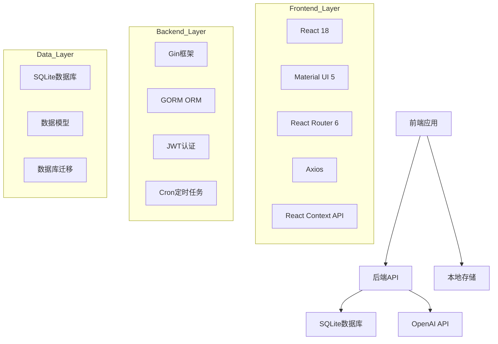
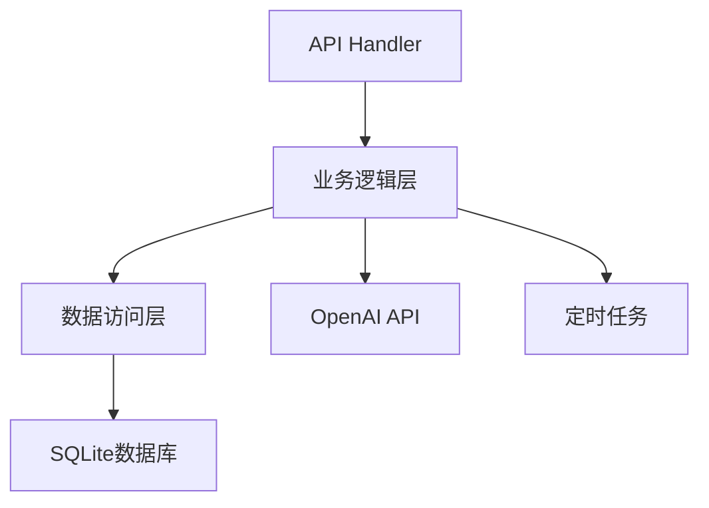

## 1. 架构设计


## 2. 技术描述
- 前端：React@18 + Material UI@5 + React Router@6 + Axios
- 初始化工具：Vite
- 后端：Go@1.25.1 + Gin@1.12.0 + GORM@1.31.1
- 数据库：SQLite
- 认证：JWT
- 第三方服务：OpenAI API

## 3. 路由定义
| 路由 | 目的 |
|------|------|
| / | 首页，财务概览 |
| /accounts | 账户管理 |
| /categories | 分类管理 |
| /transactions | 交易管理 |
| /budgets | 预算管理 |
| /tags | 标签管理 |
| /recurring | 周期交易 |
| /reminders | 提醒管理 |
| /statistics | 统计分析 |
| /ai | AI助手 |
| /data | 数据导入导出 |
| /profile | 个人设置 |
| /login | 登录页面 |
| /register | 注册页面 |

## 4. API定义
### 4.1 认证API
- `POST /api/v1/auth/register` - 用户注册
- `POST /api/v1/auth/login` - 用户登录
- `GET /api/v1/auth/me` - 获取当前用户信息

### 4.2 账本API
- `GET /api/v1/ledgers` - 获取所有账本
- `POST /api/v1/ledgers` - 创建账本
- `PUT /api/v1/ledgers/:id` - 更新账本
- `DELETE /api/v1/ledgers/:id` - 删除账本

### 4.3 交易API
- `GET /api/v1/transactions` - 获取交易列表
- `POST /api/v1/transactions` - 创建交易
- `PUT /api/v1/transactions/:id` - 更新交易
- `DELETE /api/v1/transactions/:id` - 删除交易

### 4.4 账户API
- `GET /api/v1/accounts` - 获取账户列表
- `POST /api/v1/accounts` - 创建账户
- `PUT /api/v1/accounts/:id` - 更新账户
- `DELETE /api/v1/accounts/:id` - 删除账户

### 4.5 分类API
- `GET /api/v1/categories` - 获取分类列表
- `POST /api/v1/categories` - 创建分类
- `PUT /api/v1/categories/:id` - 更新分类
- `DELETE /api/v1/categories/:id` - 删除分类

### 4.6 AI API
- `POST /api/v1/smart/classify` - 智能分类
- `POST /api/v1/smart/learn` - 学习分类
- `GET /api/v1/smart/patterns` - 获取分类模式

## 5. 服务器架构图


## 6. 数据模型
### 6.1 数据模型定义
```mermaid
erDiagram
    USER ||--o{ LEDGER : owns
    LEDGER ||--o{ TRANSACTION : contains
    LEDGER ||--o{ ACCOUNT : has
    LEDGER ||--o{ CATEGORY : has
    LEDGER ||--o{ BUDGET : has
    LEDGER ||--o{ REMINDER : has
    TRANSACTION }o--|| CATEGORY : belongs_to
    TRANSACTION }o--|| ACCOUNT : from
    TRANSACTION }o--|| ACCOUNT : to
    TRANSACTION ||--o{ ATTACHMENT : has
    TRANSACTION ||--o{ TAG : has
    TRANSACTION }o--|| RECURRING_TRANSACTION : generated_from
    BUDGET }o--|| CATEGORY : for
    REMINDER }o--|| TRANSACTION : about
```

### 6.2 数据定义语言
```sql
-- 用户表
CREATE TABLE users (
    id INTEGER PRIMARY KEY AUTOINCREMENT,
    name TEXT NOT NULL,
    email TEXT UNIQUE NOT NULL,
    password_hash TEXT NOT NULL,
    theme TEXT DEFAULT 'light',
    created_at DATETIME DEFAULT CURRENT_TIMESTAMP,
    updated_at DATETIME DEFAULT CURRENT_TIMESTAMP
);

-- 账本表
CREATE TABLE ledgers (
    id INTEGER PRIMARY KEY AUTOINCREMENT,
    user_id INTEGER NOT NULL,
    name TEXT NOT NULL,
    description TEXT,
    currency TEXT DEFAULT 'CNY',
    created_at DATETIME DEFAULT CURRENT_TIMESTAMP,
    updated_at DATETIME DEFAULT CURRENT_TIMESTAMP,
    sync_id TEXT
);

-- 账户表
CREATE TABLE accounts (
    id INTEGER PRIMARY KEY AUTOINCREMENT,
    ledger_id INTEGER NOT NULL,
    name TEXT NOT NULL,
    type TEXT NOT NULL,
    currency TEXT DEFAULT 'CNY',
    initial_balance REAL DEFAULT 0,
    note TEXT,
    created_at DATETIME DEFAULT CURRENT_TIMESTAMP,
    updated_at DATETIME DEFAULT CURRENT_TIMESTAMP,
    sync_id TEXT
);

-- 分类表
CREATE TABLE categories (
    id INTEGER PRIMARY KEY AUTOINCREMENT,
    ledger_id INTEGER NOT NULL,
    name TEXT NOT NULL,
    kind TEXT NOT NULL, -- income, expense
    icon TEXT,
    sort_order INTEGER DEFAULT 0,
    parent_id INTEGER DEFAULT 0,
    level INTEGER DEFAULT 1,
    created_at DATETIME DEFAULT CURRENT_TIMESTAMP,
    updated_at DATETIME DEFAULT CURRENT_TIMESTAMP,
    sync_id TEXT
);

-- 交易表
CREATE TABLE transactions (
    id INTEGER PRIMARY KEY AUTOINCREMENT,
    ledger_id INTEGER NOT NULL,
    type TEXT NOT NULL, -- income, expense, transfer
    amount REAL NOT NULL,
    category_id INTEGER,
    account_id INTEGER NOT NULL,
    to_account_id INTEGER,
    happened_at DATETIME DEFAULT CURRENT_TIMESTAMP,
    note TEXT,
    recurring_id INTEGER DEFAULT 0,
    created_at DATETIME DEFAULT CURRENT_TIMESTAMP,
    updated_at DATETIME DEFAULT CURRENT_TIMESTAMP,
    sync_id TEXT
);

-- 标签表
CREATE TABLE tags (
    id INTEGER PRIMARY KEY AUTOINCREMENT,
    ledger_id INTEGER NOT NULL,
    name TEXT NOT NULL,
    color TEXT DEFAULT '#4CAF50',
    sort_order INTEGER DEFAULT 0,
    created_at DATETIME DEFAULT CURRENT_TIMESTAMP,
    sync_id TEXT
);

-- 交易标签关联表
CREATE TABLE transaction_tags (
    id INTEGER PRIMARY KEY AUTOINCREMENT,
    transaction_id INTEGER NOT NULL,
    tag_id INTEGER NOT NULL,
    created_at DATETIME DEFAULT CURRENT_TIMESTAMP
);

-- 附件表
CREATE TABLE attachments (
    id INTEGER PRIMARY KEY AUTOINCREMENT,
    transaction_id INTEGER NOT NULL,
    file_name TEXT NOT NULL,
    original_name TEXT NOT NULL,
    file_size INTEGER,
    mime_type TEXT,
    created_at DATETIME DEFAULT CURRENT_TIMESTAMP
);

-- 预算表
CREATE TABLE budgets (
    id INTEGER PRIMARY KEY AUTOINCREMENT,
    ledger_id INTEGER NOT NULL,
    type TEXT NOT NULL, -- total, category
    category_id INTEGER DEFAULT 0,
    amount REAL NOT NULL,
    period TEXT DEFAULT 'monthly',
    start_day INTEGER DEFAULT 1,
    enabled BOOLEAN DEFAULT TRUE,
    created_at DATETIME DEFAULT CURRENT_TIMESTAMP,
    updated_at DATETIME DEFAULT CURRENT_TIMESTAMP,
    sync_id TEXT
);

-- 周期交易表
CREATE TABLE recurring_transactions (
    id INTEGER PRIMARY KEY AUTOINCREMENT,
    ledger_id INTEGER NOT NULL,
    type TEXT NOT NULL,
    amount REAL NOT NULL,
    category_id INTEGER,
    account_id INTEGER NOT NULL,
    to_account_id INTEGER,
    start_date DATETIME NOT NULL,
    end_date DATETIME,
    frequency TEXT NOT NULL, -- daily, weekly, monthly, yearly
    interval INTEGER DEFAULT 1,
    note TEXT,
    enabled BOOLEAN DEFAULT TRUE,
    created_at DATETIME DEFAULT CURRENT_TIMESTAMP,
    updated_at DATETIME DEFAULT CURRENT_TIMESTAMP
);

-- 提醒表
CREATE TABLE reminders (
    id INTEGER PRIMARY KEY AUTOINCREMENT,
    ledger_id INTEGER NOT NULL,
    type TEXT NOT NULL, -- transaction, budget, recurring
    target_id INTEGER NOT NULL,
    message TEXT NOT NULL,
    remind_at DATETIME NOT NULL,
    is_notified BOOLEAN DEFAULT FALSE,
    created_at DATETIME DEFAULT CURRENT_TIMESTAMP,
    updated_at DATETIME DEFAULT CURRENT_TIMESTAMP
);

-- 通知表
CREATE TABLE notifications (
    id INTEGER PRIMARY KEY AUTOINCREMENT,
    user_id INTEGER NOT NULL,
    type TEXT NOT NULL,
    title TEXT NOT NULL,
    message TEXT NOT NULL,
    is_read BOOLEAN DEFAULT FALSE,
    created_at DATETIME DEFAULT CURRENT_TIMESTAMP
);

-- 分类模式表（用于AI学习）
CREATE TABLE transaction_patterns (
    id INTEGER PRIMARY KEY AUTOINCREMENT,
    ledger_id INTEGER NOT NULL,
    keyword TEXT NOT NULL,
    category_id INTEGER NOT NULL,
    confidence REAL DEFAULT 0.8,
    created_at DATETIME DEFAULT CURRENT_TIMESTAMP,
    updated_at DATETIME DEFAULT CURRENT_TIMESTAMP
);
```

## 7. 技术实现细节
### 7.1 前端实现
- 使用React Context API进行状态管理
- 响应式设计使用Material UI的sx属性
- 路由使用React Router 6的Outlet和Layout
- API调用使用Axios拦截器处理认证
- 表单验证使用Material UI的表单组件

### 7.2 后端实现
- Gin框架处理HTTP请求
- GORM进行数据库操作
- JWT进行用户认证
- Cron定时任务处理周期交易和提醒
- 中间件处理CORS、日志、错误处理

### 7.3 AI集成
- OpenAI API进行智能分类
- 本地模式学习提高分类准确性
- 交易分析和预算建议

### 7.4 性能优化
- 前端：组件懒加载、虚拟列表、缓存
- 后端：数据库索引、查询优化、缓存
- 图片和资源优化